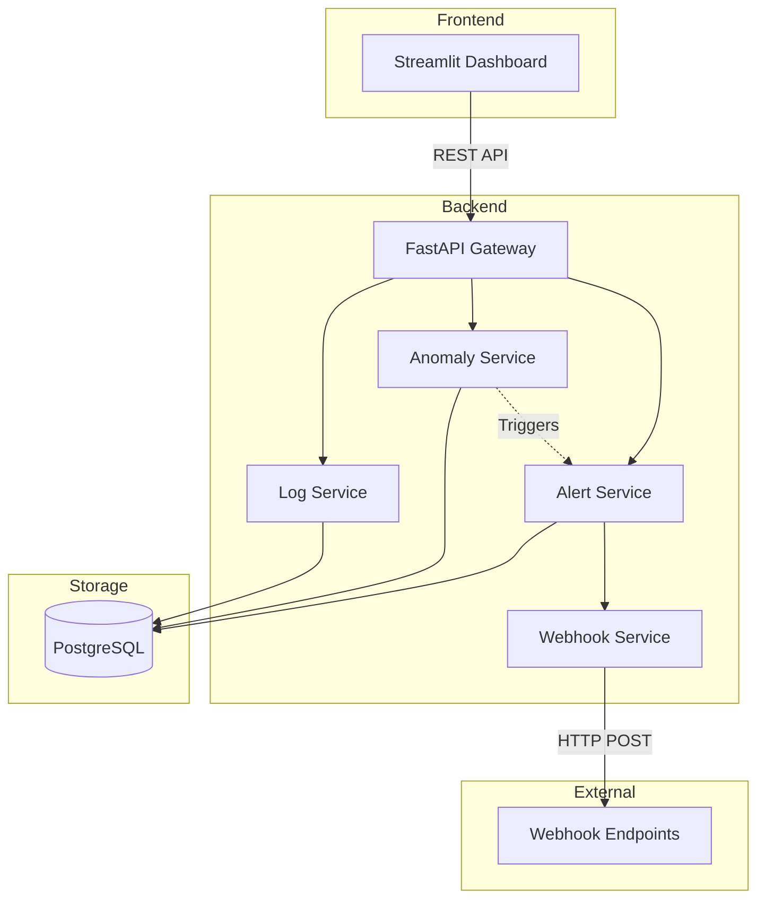
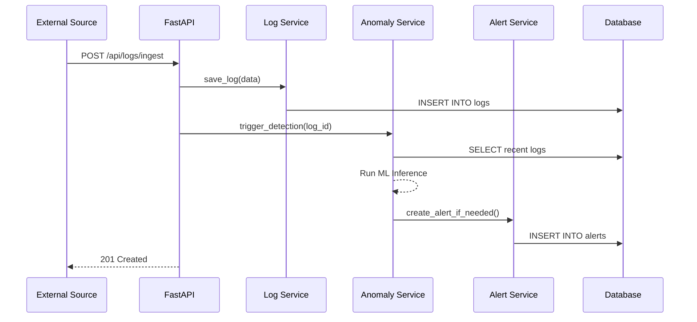
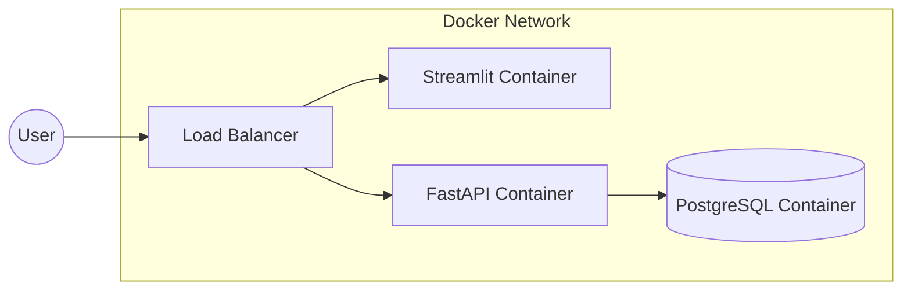

# EventWatch AI Architecture

This document describes the high-level architecture of the EventWatch AI system.

## 🏗️ System Overview

EventWatch AI is a modular observability platform designed for intelligent log analysis and anomaly detection. It follows a decoupled, service-oriented architecture.

---

## 🛰️ Layered Architecture

### 1. Dashboard Layer (Streamlit)
The user interface is built with Streamlit, providing a real-time view of system health, log trends, and detected anomalies.
- **Overview**: High-level metrics and health scores.
- **Log Explorer**: Deep search and filtering.
- **Anomaly Analysis**: Visualization of ML detection results.
- **Alert Center**: Incident management.

### 2. API Layer (FastAPI)
Acts as the entry point for all internal and external communication.
- **Pydantic Validation**: Ensures data integrity.
- **Async Operations**: High-performance log ingestion.
- **Interactive Documentation**: Swagger/OpenAPI support.

### 3. Service Layer
Contains the core business logic, decoupled from the API endpoints.
- **LogService**: Handles ingestion, bulk uploads, and retrieval.
- **AnomalyService**: Orchestrates detection runs using statistical and ML models.
- **AlertService**: Evaluates rules and triggers notifications.
- **WebhookService**: Integrates with external systems.

### 4. Data Layer (PostgreSQL)
Persistent storage for all platform data.
- **Logs**: Historical event data.
- **Anomalies**: Detected deviations.
- **Alerts**: Incident records.

---

## 📈 Data Flow

### Log Ingestion & Detection Flow
1. **Ingest**: Logs arrive via API or File Upload.
2. **Process**: `LogService` parses and saves to DB.
3. **Analyze**: `AnomalyService` runs detection algorithms:
    - Statistical Analysis (Rate/Spikes)
    - Machine Learning (Isolation Forest)
4. **Alert**: If an anomaly is confirmed or thresholds met, `AlertService` creates an alert.
5. **Notify**: `WebhookService` sends payload to external endpoints.

---

## 🚀 Deployment Architecture

The system is containerized using Docker, allowing for easy scaling of the Dashboard and API components.

